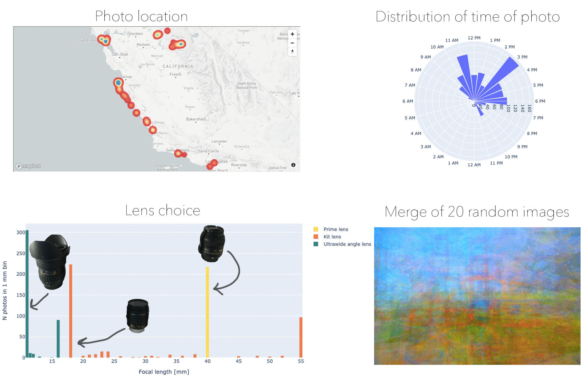

# Analysis-of-metadata-from-holiday-photos
An analysis just for fun of the metadata in holiday photos.

There is no point in this analysis, except for the fact I wanted to play with geodata.

### Metadata
First, JPGs contain metadata: lens used, focal length, exposure time and, in some cases, GPS coordinates.
For that I am using the `exif` module for Python.
It works well except that it is unable to read
the `components_configuration` attribute (what DSLR lens used) and
the direction of the GPS coordinates is wrong, `gps_longitude_ref` is blank when it should be "W" and
my camera does not save `gps_longitude` as a negative number.

### Geodata
I had first played with a choropleth map with plotly. This great and all straightforward.
However, the maps available are limited to USA or world.
I switched to mapbox (free basically for sporadic use), which has a lot more plot types, a map that can zoom down to the street level (semantic zoom, not geometric zoom).
Had one the time, one could even make custom regions, say colleges in the university.
For the photos I used a heatmap map (`HeatmapViz`).
This has three values that need to be set, which are a bit cryptic. The `mapboxgl.utils` contains several functions
that helps make the values required, such as `df_to_geojson` to make the points, but also three functions to make "stops".
Basically, you have to first specify "breaks", a list of values representing the count threshholds.
Element 0 has to be greater than 0.0, and all subsequent elements greater than the previous:
90% of bugs I had were because of this. The problem however is getting a nice spacing 
as the distribution of photos per location is not linear.
One can set the values manually
or use the `mapboxgl.utils.scale_between` function.
There may be better ways than manual, such `pysal.esda.mapclassify`, which I have not tried.

### Figure

